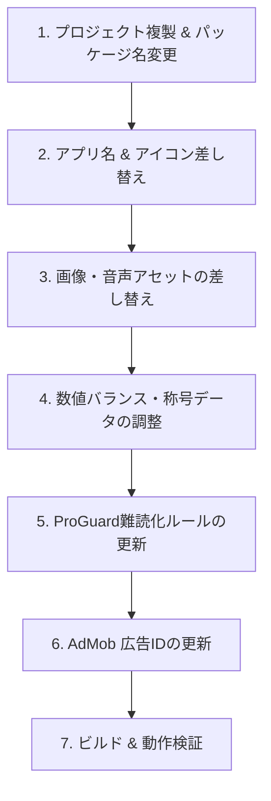

# 派生タップアプリ作成ガイド (derivative_apps.md)

---

## 📌 簡単な説明 (要点まとめ)

1. **プロジェクトをまるごとコピーして始める**
   * この『100万回のたまご』のコードをテンプレートとして複製します。
2. **画像・音・名前・数値を差し替えるだけで完成する**
   * **画像**: 卵から「スイカ」「金庫」「モンスター」などに変更（`res/drawable/`）。
   * **音**: タップ音やクリア音を変更（`res/raw/`）。
   * **名前・数**: アプリ名、アイコン、目標タップ数（10万回など）、称号テキストを変更。
3. **データ混同・ProGuard難読化・広告IDに注意する**
   * 保存ファイル名（`json`）、パッケージ変更時の `proguard-rules.pro` 設定、および AdMob 広告IDを新アプリ用に変更します。

---

## 📖 詳しい説明 (量産・手順仕様)

### 1. 開発フロー概要



---

### 2. 詳細手順

#### Step 1. プロジェクトの複製と識別子の変更
1. **フォルダの複製**: プロジェクトフォルダ全体を別名（例: `watermelon_tap`）で複製します。
2. **Application ID / パッケージ名の変更** (`app/build.gradle.kts`):
   ```kotlin
   android {
       namespace = "com.akito.watermelon_tap"
       defaultConfig {
           applicationId = "com.akito.watermelon_tap"
       }
   }
   ```
3. **DataStore 保存ファイル名の変更** (`MillionEggApp.kt`):
   * 他アプリと保存データが衝突しないよう、保存ファイル名を変更します：
   ```kotlin
   val Context.playerStateStore by dataStore(
       fileName = "player_state_watermelon.json",
       serializer = PlayerStateSerializer
   )
   ```

#### Step 2. アプリ名とアイコンの変更
1. **アプリ名の変更** (`app/src/main/res/values/strings.xml`):
   ```xml
   <resources>
       <string name="app_name">10万回のスイカ(ミリスイ)</string>
       <string name="app_icon_name">ミリスイ</string>
   </resources>
   ```
2. **アイコン画像の差し替え** (`app/src/main/res/drawable/app_icon_foreground.png`):
   * 新アプリのアイコン画像を配置します。

#### Step 3. 画像アセット（オブジェクト）の差し替え
📁 **配置場所**: `app/src/main/res/drawable/`

| アセット | ファイル名 | 説明 |
| :--- | :--- | :--- |
| **無傷の状態** | `egg_damage0.png` | ゲーム開始時のきれいな状態の画像 |
| **ダメージ段階** | `egg_damage1.png` 〜 `egg_damage8.png` | 耐久値減少に応じて変化するダメージ画像 |
| **完全破壊（0）** | `egg_damage10.png` | カウント0で割れた・壊れた状態の画像 |
| **フィーバー用** | `egg_g.png` | フィーバータイム中に変化する画像 |

#### Step 4. 音声アセットの差し替え
📁 **配置場所**: `app/src/main/res/raw/`

* `tap.mp3` : 通常タップ音
* `critical.mp3` : クリティカルヒット音
* `fever.mp3` : フィーバー中のタップ音
* `coin.mp3` : コイン（ゴールド）獲得音
* `status_up.mp3` : ステータス強化音
* `game_clear.mp3` : クリア（エンドロール）時のBGM/サウンド

#### Step 5. ゲームバランス・称号データの調整
1. **初期カウント数およびエンディング制御プロパティ** (`GameProgress.kt`):
   ```kotlin
   @Serializable
   data class GameProgress(
       val remainingTaps: Long = 100_000L, // 例: 10万回に変更
       val totalDamage: Long = 0L,
       val tapCount: Long = 0L,
       val isCleared: Boolean = false,
       val startDateMillis: Long = System.currentTimeMillis(),
       val hasSeenEnding: Boolean = false // エンディング視聴済みフラグ
   )
   ```
2. **称号（アチーブメント）の書き換え** (`PlayerState.kt`):
   ```kotlin
   val Titles = listOf(
       Title("スイカ初心者", 500L, powerBonus = 1),
       Title("スイカ割りの達人", 10000L, powerBonus = 2, criticalBonus = 0.01),
       Title("スイカの神", 100000L, powerBonus = 8, criticalBonus = 0.08)
   )
   ```

#### Step 6. ProGuard 難読化保護ルールのパッケージ名更新 (`app/proguard-rules.pro`)
パッケージ名を新アプリ（例: `com.akito.watermelon_tap`）に変更した場合、DataStoreモデルが難読化で壊れないよう ProGuard ルールのパッケージパスを新パッケージ名へ更新します：
```proguard
-keepclassmembers class com.akito.watermelon_tap.GameProgress { *; }
-keepclassmembers class com.akito.watermelon_tap.PlayerState { *; }
-keepclassmembers class com.akito.watermelon_tap.Title { *; }
```

#### Step 7. AdMob 広告IDの更新
1. **ManifestのApp ID** (`app/src/main/AndroidManifest.xml`):
   ```xml
   <meta-data
       android:name="com.google.android.gms.ads.APPLICATION_ID"
       android:value="ca-app-pub-XXXXXXXXXXXXXXXX~XXXXXXXXXX"/>
   ```
2. **各広告ユニットID** (`AdManager.kt`):
   * バナー、インタースティシャル、リワード広告のユニットIDを新アプリのものに変更します。

---

### 3. 完成チェックリスト

- [ ] パッケージ名・ApplicationId が変更されているか
- [ ] DataStore のファイル名（.json）がユニークになっているか
- [ ] `proguard-rules.pro` の DataStore クラス保持パスが新パッケージ名に合致しているか
- [ ] アプリ名・アイコン画像が正常に表示されるか
- [ ] オブジェクト画像（ダメージ変化）が正常に切り替わるか
- [ ] 全効果音が正常に鳴るか
- [ ] カウント0でクリア画面・エンドロール・BGMが正常に再生されるか
- [ ] 再起動時にクリア画面が重複再生されず、リセットダイアログから再視聴できるか
- [ ] AdMob 広告が正常に読み込まれるか
